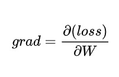

# A brief introduction to backpropagation 
> "Learning from one's mistakes"

I won't go into the brutal mathematical notations which are generally used, instead I'll try my best to explain it in terms of simple analogies and examples.  

I'll divide this into 2 sections:
1. The math behind backprop
2. How it works in practice 

## The math behind backprop

**Let's walk down a hill first**

The first step to walk down the hill, is to know which way is down, and that is exactly where the "gradient" comes in. 

**So which way is "down" ?**

It's the direction in which the rate of descent is the highest per step taken. 

Where `a` is the altitude, and `s` is the number of steps taken. Notice how there's a `-` sign there as well, it's there because we're concerned with "descent" and not "ascent". 

**How does it apply to neural networks ?**

In simple terms, when a neural network is training, all that it's doing is walking through an "n-dimensional" mountain range (where "altitude" is the loss) and trying to find the lowest point possible (minimum loss). 

So the most efficient direction to take in general is to move in the direction of the steepest "descent". 

**Dummy example**

In order to walk down the hill, we'll need to know two things first:

* Which way is down ? 
* How big of a step do we take ? 

**Which way is down ?**

Imagine a small "single neuron" neural network. For the sake of simplicity, we'll not consider biases for now, you can imagine weights "W" as a set of all the parameters within it. 

Let us first make a prediction using this model and calculate the loss. 

The gradient of the loss with respect to the weight `W` defines how the loss would change with a small change in the weights. 

 But wait, `grad` gives us the "direction" of the steepest "ascent". And the direction of "steepest descent" would be exactly in the opposite direction. Hence the direction of the steepest descent would be `-grad`.

**How big of a step do we take ?**

 So now we know which direction to go in order to decrease the loss, but the question is how big of a step do we take ? Do we wingsuit down the hill at full speeed or do we take a slow stroll. 

 This is where learning rate comes in, it defines how much do we alter the weight(s) at each iteration (step).

**Taking a step**

In a learning step, we update the weight(s) so as to minimize the loss. It's like taking one small step down the hill.

> reminder: `-grad` because we want "descent" and not "ascent". 

`Wn` is the new updated weight after a single step. 

## So what happens when we have multiple layers ? 

**Imagine this:**

* If a man is on foot, his actions directly affects the path he takes through the hills. It is difficult to move through rough terrain when on foot. 

* If a man is on a horse, his actions affects the horse (and not the path taken), which in turn affects the path taken for descent. This seems better for moving through rough terrain. 

The man on foot is a single layer model, and the man on the horse is a double layer model. 

The output of `Wa` affects the output of `Wb`, and the output of `Wb` affects the `loss`. 

Now in order to update the weights here, we'll need to calculate two gradients:
1. `d(loss)/d(Wa)`
2. `d(loss)/d(Wb)`

But the `loss` is not directly affected by `Wa`, so how do we find `d(loss)/d(Wa)` ? 

**This is exactly where the chain rule comes in:**

If `z` depends on `y` and `y` depends on `x`, then:

In our case,
* `z` is `loss`
* `x` is `Wa`
* `y` is `Wb`

So we update the weights as follows:

 

> Where `Wan` and `Wbn` are the updated weights after a single step. 

## How it works in practice
