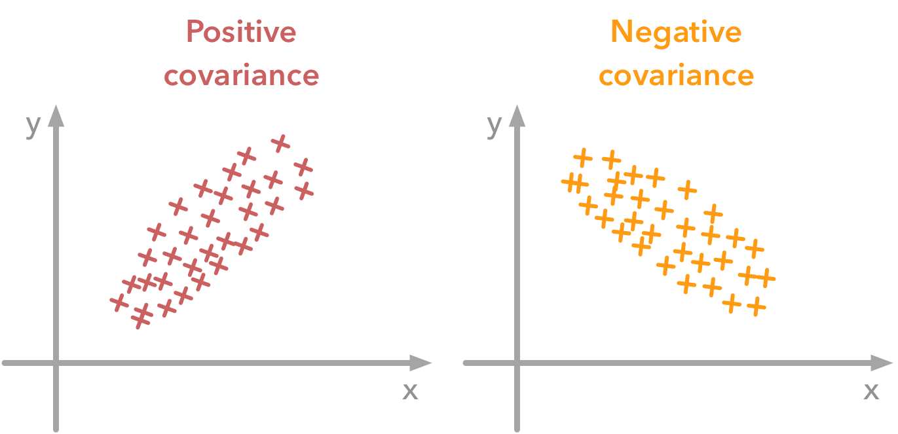
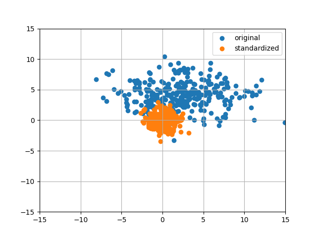

## Covariance, and some notes on data preprocessing

Let us split the word into two, "Co" and "Variance".

* "Co" is a prefix used to refer to something mutual/common. 

* "Variance" is where it gets interesting. In simple terms, it can be defined as the measure of how "spread" a set of data is. 

For example, `[9,2,-3]` is more "spread" than `[1,3,2]`. Hence `[9,2,-3]` is has a higher "variance". 

Mathematically, it is the average squared deviation from the mean score.

```python
def variance(data):
    mean = sum(data) / len(data)
    variance = sum((xi - mean) ** 2 for xi in data) / len(data)
    return variance 

data = [1,2,3]
print(variance(data))
```

Thankfully, numpy has our back on this one. So finding the variance is as easy as: 

```python
import numpy as np
print (np.var(data))
```

Co-variance tells us the extent to which the corresponding elements from two sets of ordered data move in the same direction.

```python 
def covariance(a, b):

    a_mean = sum(data) / len(data)
    b_mean = sum(data) / len(data)

    sum_all = 0

    for i in range(0, len(a)):
        sum_all += ((a[i] - a_mean) * (b[i] - b_mean))
    return sum_all/(len(a)-1)

a = [1,2,3]
b = [4,4.2,9]

print(covariance(a,b))
```

And yet again, numpy has us covered:

```python
print (np.cov(a,b)[0][1])
```

Hold on, why do we have a `[0][1]` here ? That's because `np.cov` returns the covariance matrix. It is a square matrix giving the covariance between each pair of elements. 

In a covariance matrix, the variances appear along the diagonal and covariances appear in the off-diagonal elements.

Now let us try to understand this with an example:

```python
a = [10,8, 4]
b = [6,4,2]

print(np.cov(a,b))
```

Which prints:

```
[[9.33333333 6.        ]
 [6.         4.        ]]
```

Which translates to:

```
[
    [np.cov(a,a),  np.cov(a,b)],
    [np.cov(a,b),  np.cov(b,b)]
]
```
Here, the diagonal elements are the co-variances of the elements with themselves. The co-variance between `a` and `a` is just the variance of `a`. 

The non diagonal elements are the co-variances between `a` and `b` (`[0][1]`) and `b` and `a` (`[1][0]`) are the same. Note that `np.cov(a,b)` is equal to `np.cov(b,a)`. 

Negative and positive co-variance between 2 sets of values `x` and `y` can be given as:



## Preprocesssing 

### Mean normalization

It will have the effect of centering the data around 0.

```python
import matplotlib.pyplot as plt

def mean_normalization(X):
    newX = X - np.mean(X, axis = 0)
    return newX

b = np.random.normal(2, 0.5, 20)

plt.plot(b, label = "original data")
plt.plot(mean_normalization(b), label = "after mean normalization")
plt.legend()
plt.grid()
plt.show()
```

### Standardization 

Standardization is used to put all features on the same scale. It is done by dividing each element in the zero-centered (mean normalized) set by it's standard deviation. 

```python
def standardize(X):
    standarized= mean_normalization(X)/np.std(X, axis = 0)
    return standarized
```

For example, let us consider 2 sets of values in 2 different scales:

```python
a =  np.random.normal(3, 4, 300)
b = np.random.normal(4, 2, 300)
```

When we standardise the two sets, one can see that the scales are the same and that the dataset is zero-centered according to both axes (shown below)

```python
all_data = np.array([a,b]).T
standard_data = standardize(all_data)
standard_a, standard_b = standard_data[:, 0], standard_data[:, 1]

plt.scatter(a,b, label = "original")
plt.scatter(standard_a,standard_b, label = "standardized")

plt.xlim(-15,15)
plt.ylim(-15,15)
plt.legend()
plt.grid()
plt.tight_layout()
plt.show()
```



Now if we check the covariance matrix of the standardized data, we'll see that the variance of each set is 1. 

```python
print(np.cov(standard_data, rowvar=False, bias=True))
```

Would give someting like: 

```
[[1.         0.01873522]
 [0.01873522 1.        ]]
```

Notice how all the diagonal elements are 1. 