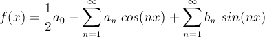
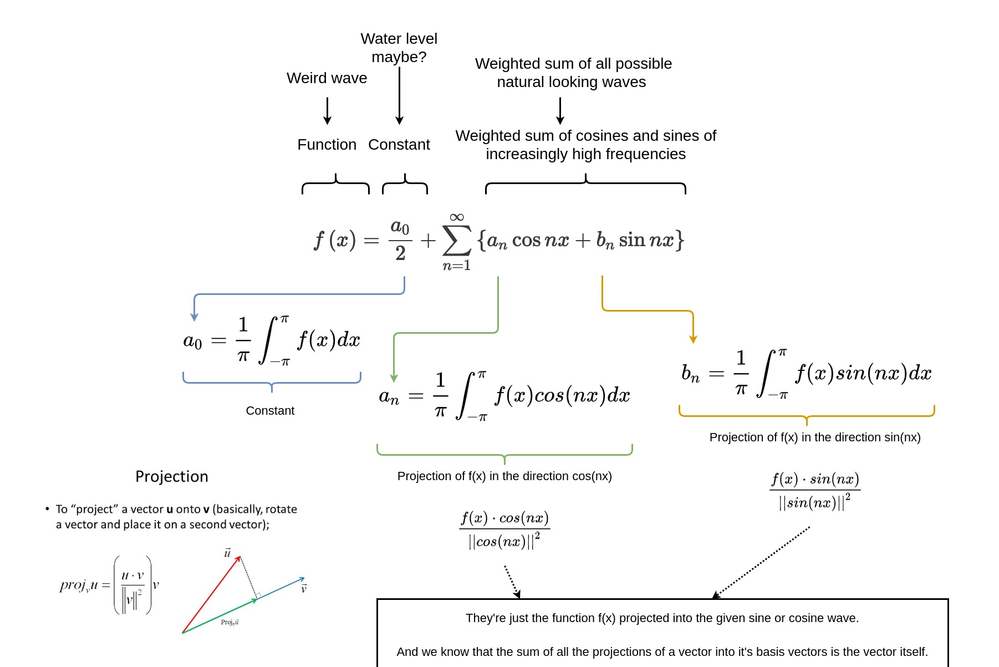

## The Fourier Transform   
> A view of the ocean

Let us assume that you're on a beach. As you look into the waves, you notice something. 

You notice that some parts of the ocean are not exactly "wave-like". They don't have those familiar crests and troughs `^\_/^\_/^\_/^\_/^`

This small patch of water has very odd looking wavelets, which somehow look random. 

That random patch is actually a certain mixture of the familiar waves that we all see. So you think:

 ```python
 good_wave + another_good_wave = weird_wave
 ```

If Joseph Fourier was standing beside you, he'd wonder which good waves were used to make up this weird little wave. That is exactly what he did.

He said that given a weird wave, he can express it as a mixture of the natural looking waves that we're all familiar with. 

Fourier said that given a function`f(x)`, we can express it in terms of cosines and sines of increasingly high frequencies. 



In other words, fourier series is a way to write `f(x)` in an orthogonal basis of sines and cosines. 

Here's a diagram I made for a better understanding:



## Significance of FFT

A polynomial can be represented in 2 forms: 

* Vector form: `[a0, a1, a2, a3...]`
* Value form: `{set of n points for a  polynomial of degreen n-1}`

For example, let us take: `F(x) = 5 + x + 2x^2 + x^3` (degree = `3`)

* vector form: `[5,1,2,1]` 
* value form: `{(-2.433, 0), (-1,5), (-0.333, 4.852), (0,5)}`

Our objective is to find the square of this polynomial, we can do this in one of the 2 forms. 

* Vector form:

    ```python
    import numpy as np

    a = np.array([5,1,2,1])

    coeffs_of_a_squared = (np.convolve(a,a))
    print(coeffs_of_a_squared)

    '''
    output: 
        [25 10 21 14  6  4  1] 
    '''
    ```
    To find the product of 2 polynomials in vector form, we have to use the convolution operation -> `np.convolve(a,b)`

    Sounds pretty easy, but it does take  `O(n^2)` multiplications to complete the total operation.

* Value form:

    ```python
    values = np.array([
        [-2.433, 0], 
        [-1,5], 
        [-0.333, 4.852], 
        [0,5],
        [-3,-7],
        [3, 53],
        [9, 905]
    ])

    print(values*values)  ## simple element wise multiplication

    '''
    output:
        [[5.9194890e+00 0.0000000e+00]
        [1.0000000e+00 2.5000000e+01]
        [1.1088900e-01 2.3541904e+01]
        [0.0000000e+00 2.5000000e+01]
        [9.0000000e+00 4.9000000e+01]
        [9.0000000e+00 2.8090000e+03]
        [8.1000000e+01 8.1902500e+05]]
    '''

    ```

    To find the product of 2 polynomials in value form, we can simply multiply the corresponding points element-wise which takes `O(n)` operations.

    This gives us 7 points, and we know that: 

    For `n` points, there exists a unique polynomial of degree `n-1` going through all of them, and in our case that would be the square of `F(x)`


At first glance, it might seem like multiplying in value form is faster because it's in `O(n)`, but there's a problem:

We still have to evaluate the values of the points themselves from the polynomial, which gives us a total of n*n operations. Thus making it `O(n^2)`

**We have 2 steps to calculate the product of 2 polynomials:**
1. Evaluate the value form for the points: `O(n)`
2. Element wise multiplication of the corresponding points from the polynomials: `O(n)`

**But wait, what if we could speed up step 1 by finding more than one point per evaluation ?**

For example, in case of `F(x) = x^2`, if we put x = 1, we get a point: `(1,1)`. By symmetry, we also get `(-1,1)`. Thus getting us 2 points with a single operation. 

This exact idea applies to all polynomials, because any polynomial can be broken down into 2 parts:

For `P(x) = ax^0 + px^1 + bx^2 + qx^3 + cx^4  + rx^5`:

* even powers of x: `ax^0 + bx^2 + cx^4`
* odd powers of x: `px^1 + qx^3 + rx^5`

Therefore `P(x) = ax^0 + bx^2 + cx^4 + x(px^0 + qx^2 + rx^4)`

Both these parts can be expressed as functions of `x^2` as:

`P(x) = P_even(x^2) + x*P_odd(x^2) `

Now that we can express both these functions as a function of `x^2` it's quite easy to exploit the symmetry we found earlier to obtain 2 points per evaluation.

So, we now ask the question:

### Is it possible to find a set of transformations that transforms the vector form into value form, such that `n` values can be found with less than `n` evaluations ?

This is where FFT and IFFT come into play.

Instead of picking random points like a dummy, the FFT algorithm recursively picks points which gives it the maximum number of points (2) per evaluation.

When using FFT, the speed comes down to `O(nlog(n))` which is much faster than `O(n^2)`

In a nutshell: 

FFT and IFFT give us a faster way (than the usual) to convert a polynomial from it's vector form to it's value form and vice versa. The speed-up is obtained by exploiting the symmetries found in functions.

References:

[1] - https://www.youtube.com/watch?v=iTMn0Kt18tg

[2] - https://jakevdp.github.io/blog/2013/08/28/understanding-the-fft/

[3] - https://www.youtube.com/watch?v=h7apO7q16V0