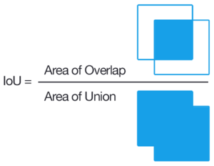
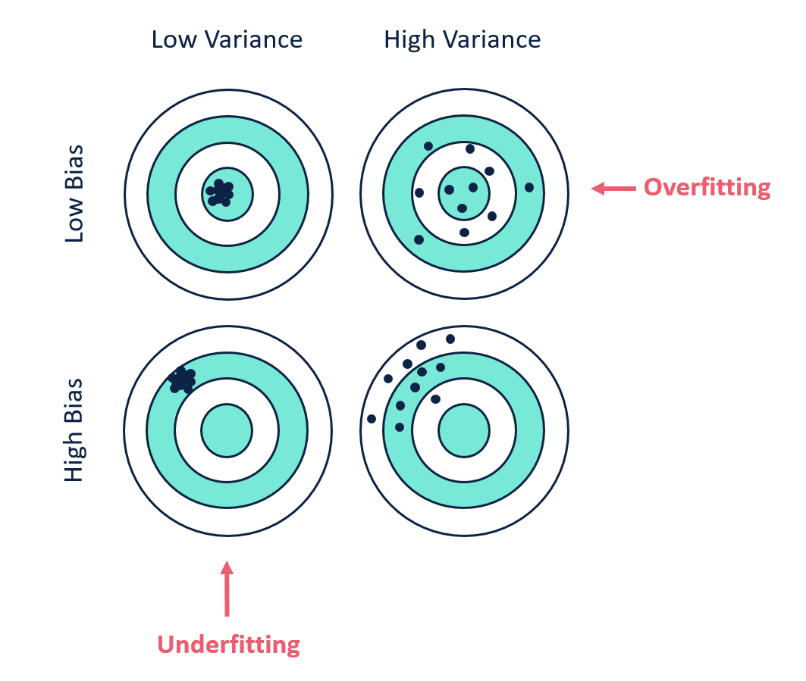

# Intuitive explanations

Explaining a bunch of random stuff that I've learned so far in case I do accidentally wipe my brain someday and want to revert.

The order is really really random, but most of the stuff here is related to deep learning

<!-- 
- chain rule -done
- backprop -done 
- why do we need activation functions ? 
    - activation functions and where to use each:
        - sigmoid
        - relu
        - leaky relu
        - tanh
- dropout layers
- weight decay 
- learning rate
- batchnorm
- vanishing gradients
- overfitting
- dying relu -> leaky relu
- residual layers

- loss functions when and why to use each 
    - MSE loss
    - NLL loss
    - cross entropy loss
    - Dice score/jaccard index
- bias variance tradeoff


- why normalizing data is important, explain `transforms.Normalize`
- what is label smoothing and why is is used sometimes 
- GANS:
    - Generator loss 
    - discriminator loss 
    - nash equilibrium 
 -->

## Chain rule 

If a small change in x causes a small change in y, and if a small change in y causes a small change in p. Then it is possible to also calculate what happens to p given a small change in x. 


## Backpropagation

Its an algorithm for calculating the gradient of a loss function with respect to variables of a model. Backprop asks the question: *By how much does each learnable parameter affect the loss ?*


```python

class SomeLayer:
    def __init__(self, w0, b0):
        """
        init weights and biases 
        """
        self.w = w0
        self.b = b0
    def forward(self, x):
        """
        local grads:
            d(out)/d(self.w) = x
            d(out)/d(self.b) = 1
        
        d(out)/d(x) = self.w
        """
        out = self.w*x + self.b
        return out 

class Model:
    def __init__(self):
        self.layer1 = SomeLayer()
        self.layer2 = SomeLayer()
        self.layer3 = SomeLayer()

    def forward(self, x):
        """
        x -> layer 1 -> x1 -> layer2 -> x2
        """
        x1 = self.layer1(x)
        x2 = self.layer2(x1)
        return x2

model = Model()
y = model(x)

loss = loss_function(y, label)
loss.backward()
```

When `loss.backward()` is called, the following things happen:
> "it" refers to the autograd engine
1. It first calculates `d(loss)/d(x2)` (how much does the loss vary given a small change in x2)

2. Once we know `d(loss)/d(x2)`, we can use it to calculate the following 3 things:

    * *How much do the weights of layer2 affect the loss ?* `d(loss)/d(layer2.w)`

    * *How much do the biases of layer2 affect the loss ?* `d(loss)/d(layer2.b)` 

    * *How much does the input of layer2 (x1) affect loss ?* `d(x2)/d(x1)` -- this will be needed when we want to "chain" the gradients from layer1 to the loss.

    ```python
    d(loss)/d(layer2.w) = d(x2)/d(layer2.w) * d(loss)/d(x2) ## where d(x2)/d(layer2.w) is known from the local gradients 
    ```

    ```python
    d(loss)/d(layer2.b) = d(x2)/d(layer2.b) * d(loss)/d(x2) ## where d(x2)/d(layer2.b) is known from the local gradients 
    ```

3. Now that we know `d(x2)/d(x1)`, we can calculate the final 2 gradients that are needed:

    * *How much do the weights of layer2 affect the loss ?* `d(loss)/d(layer1.w)`

    * *How much do the biases of layer2 affect the loss ?* `d(loss)/d(layer1.b)`  

    ```python
    d(loss)/d(layer1.w) = d(x1)/d(layer1.w) * d(x2)/d(x1) * d(loss)/d(x2) ## where d(x1)/d(layer1.w) is known from the local gradients 
    ```

     ```python
    d(loss)/d(layer1.b) = d(x1)/d(layer1.b) * d(x2)/d(x1) * d(loss)/d(x2) ## where d(x1)/d(layer1.w) is known from the local gradients 
    ```

A more serious explanation [can be found here](https://github.com/Mayukhdeb/math-stuff/tree/main/backprop).

## Activation functions

**Why do we even need them ?**

It helps the network learn complex data, compute and learn almost any function representing a question, and provide accurate predictions.

Without non linear activations, a model with 2 layers might look like: 

```python
y = w2(w1*x + b1) + b2
```

which can be boiled down to a single linear transformation:

```python
y = w1*w2*x + (w2*b1 + b2)
```

A linear transformation is limited in its capacity to solve complex problems and hold less power to learn complex functional mappings from data.

**Which ones should I look out for ?**

* ReLU: This one simply acts like an identity function for all values > 0. 
> One common problem we face with this one is the dying relu problem. Which gets fixed by using a leaky relu. 

* Leaky ReLU: This one fixes the problem that relu had by not completely killing the gradients for negative values to zero.

* Sigmoid: Whatever be the input, the outputs of a sigmoid get bound between 0 and 1. 

> This one has a problem too: for very high or very low values of inputs, there is almost no change to the prediction, causing a vanishing gradient problem. OK  there's actually [another problem](https://rohanvarma.me/inputnormalization/)
            
* Tanh: This one's pretty similar to sigmoid, except that it's values range from -1 to 1 (unlike sigmoid where it's 0 to 1).

## Dropout layers 

Whe training neural nets, we dont really want a certain small set of "neurons" to take the most of the responsibility behind every decision. 

Imagine you're a teacher who has given his students a group project, you dont want it such that only a few people work in each group and the rest of them just chill. 

So in order to fix that, you make it compulsory for 30% of the members (selected at random) to take a leave every day. This ensures that everyone in the group works equally hard  contribute to the outputs. 

When you use a dropout layer, some number of layer outputs are randomly ignored or “dropped out.” it has the effect of making the training process noisy, forcing nodes within a layer to probabilistically take on more or less responsibility for the inputs.


## Weight decay 

Weight decay is a way to make sure that your neural net's weights dont get too "complex". I like to think of it as telling the NN: "dont act too smart". This is how it works: 

```python
def l2_penalty(w):
    """
    calculates the L2 penalty given a set of weights
    """
    return torch.sum(w.pow(2)) / 2

loss = your_loss_function(label, pred) + weight_decay_constant * l2_penalty(weights^2)
```

Some smarties also like to call this L2 regularization. 

## Batch Normalization

A Batch Normalization layer transforms each input in the current mini-batch by:

1. Subtracting the input mean in the current mini-batch
2. Dividing it by the standard deviation.

*Training Deep Neural Networks is complicated by the fact that the distribution of each layer’s inputs changes during training, as the parameters of the previous layers change. This slows down the training by requiring lower learning rates and careful parameter initialization, and makes it notoriously hard to train models with saturating nonlinearities.*

— [Batch Normalization: Accelerating Deep Network Training by Reducing Internal Covariate Shift, 2015](https://arxiv.org/abs/1502.03167)

## Vanishing Gradients 

Activation functions like sigmoid squeeze large input values to be between 0 ane 1. Hence a large change in the input will only cause a small change in the output i.e very small gradient values. 

*When n hidden layers use an activation like the sigmoid function, n small derivatives are multiplied together. Thus, the gradient decreases exponentially as we propagate down to the initial layers -- they tend to "vanish" as we propagate back to the early layers*

**How can we fix it ?**

* Use some other activation function like ReLU where the gradients dont become "too small".

* Use Residual layers

* Batch normalization also helps! because it makes sure that the |input| does not reach the outer edges of the sigmoid function (hence no small gradients)

## Overfitting

Imagine you have a school with only one student. In that school, you teach math. The problem is that your syllabus contains only 5 sums. So instead of actually learning the concepts, your student just memorizes each of the 5 sums before the exam.

But then the student fails miserably in the exam because all that he did was memorize and not understand the concept. 

This is exactly what overfitting is, it is where the model tends to "memorize" the training data instead of actually building up an understanding of the data.

A telltale sign of overfitting is a very low training loss and a much higher validation loss (analogous to how the student performs well in the class by memorising but then fails the exam miserably)

**How do we fix overfitting ?**

* Data augmentation (equivalent to making more practice problems from the existing ones with modifications such that they look different to the stduent)

* Dropout layers 

* Weight decay 

* Sometimes a larger batch size also helps

* Reducing the complexity of the model (if you your student is smart enough, he can even memorize 1000 sums -- make sure you dont teach those kinds of students)

Of course, all of the stuff I mentioned above may vary with the training data you have. 

## Dying ReLU

It is the scenario when a large number of ReLU neurons only output values of 0. It happens when the inputs are in the negative range. Notice how the gradient of the function is zero once it hits the negative.

Once a ReLU ends up in this state, it is unlikely to recover, because the function gradient at 0 is also 0, so gradient descent learning will not alter the weights.

When most of these neurons return output zero, the gradients fail to flow during backpropagation and the weights do not get updated. Ultimately a large part of the network becomes inactive and it is unable to learn further.

**How do we fix it ?**

* Use leaky ReLU: Since it is the flat section in the negative input range that causes the dying ReLU problem, we can fix it by keeping a small slope instead in the negative range such that the gradients dont "die out altogether".

* Use a non symmetric initialization procedure which has been [described in the paper](https://arxiv.org/pdf/1903.06733.pdf). 

## Residual layers

One common problem that we've all faced when working with NNs is to find a way to make sure that the gradients do manage to gracefully travel back through a deep network. 

One such way to make sure that the gradient information properly travels back through the layers is to use a residual layer.

I really do not know why people like to call it a "layer", because it can be thought of more like an operation than that of a layer. 

Instead of:

```python
y = layer(x)
```

we do:

```python
y = x + layer(x)
```

or even something like:

```python
y = x + layer_2(layer_1(x))  ## note that ive used the term layer loosely here, it might also include the activation functions, but hey since youre reading this far I think you get the idea.
```

## Linear vs logistic regression

Linear regression: used for regression tasks, i.e tasks where the model has to predict a certain value given a set of inputs. One can use the good old MSE loss for this problem. 

Logistic regression: Used to handle classification problems. Here we'll require losses like the log loss.

## Multi class vs multilabel classification


## Loss functions

In a school of neural networks, loss functions can be thought of as teachers. Some are good for certain tasks and are bad for others. You can't just go and tell your math teacher to teach you Geography. 

In a similar way, certain loss functions are only good for certain types of tasks: 

* **MSE Loss**: This one's mostly used for **regresssion problems** where the NN has to estimate a certain output value(s) given some input(s). \

    The interesting part about this one is that it "punishes" the model a lot more for large "errors" (because it is "squared") when compared to small errors. Some people also call it "L2 loss".

    ```python
    def mse_loss(pred, label):
        loss = ((pred - label)**2)).mean()
        return loss
    ```

* **Negative Log-Likelihood Loss/Log loss**: This one can be used in **classification problems**. The model is punished for making the correct prediction with smaller probabilities and encouraged for making the prediction with higher probabilities. The logarithm does the punishment. It is generally **paired up with a softmax layer** so that the output is a nice clean probability map.

    It does not only care about the prediction being correct but also about the model being certain about the prediction with a high score. 

    

    > where `a` is the predicted value after passing through a softmax layer

* **Cross entropy loss**: It's pretty much the same thing as NLL Loss. usually, we use the term log loss for binary classification problems, and the more general cross-entropy (loss) for the general case of multi-class classification. 

    > Cross-entropy loss, or log loss, measures the performance of a classification model whose output is a probability value between 0 and 1. -[ml cheatsheet](https://ml-cheatsheet.readthedocs.io/en/latest/loss_functions.html)

    And obviously, this one's also used in **multi class clasification** problems, and also the logits need to be **passed through a softmax layer** as usual.

    ```python
    def cross_entropy_loss(pred, label):
        ## people also call it the log loss
        if label == 1:
            return -log(pred)
        else:
            return -log(1 - pred)
    ```


* **Jaccard index/ Intersection over union**: 

    

    It is is the area of overlap between the predicted segmentation and the ground truth divided by the area of union between the predicted segmentation and the ground truth.

* **Dice score**: 

    

    The denominator is the sum of total boundary pixels of both prediction and ground truth, and the numerator is the sum of correctly predicted boundary pixels. 

## Understanding bias and variance

I'll just paste in some screenshots taken from [StatQuest](https://www.youtube.com/channel/UCtYLUTtgS3k1Fg4y5tAhLbw).


The red line represents the predictions made by the model, while the blue line is the ideal "fit". This is loosely the same thing as "underfitting" (high bias low variance)


The wiggly line does a great job at fitting to the training data, but fails badly on the test set. Here the model is said to have a high variance and a low bias. Which is again loosely related to overfitting. [Source](https://www.youtube.com/watch?v=EuBBz3bI-aA).
    



