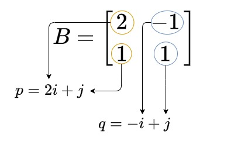
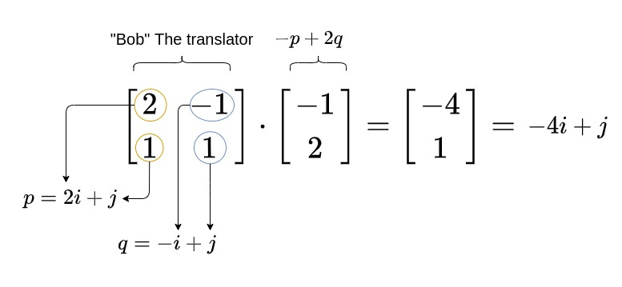
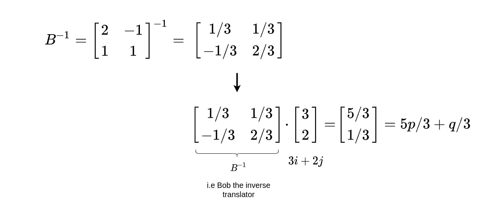

## Change of basis of a vector.
> Different language, same meaning

*warning*: This explanation contains analogies, loose terms and tacky numpy code. If you want a more concrete mathematical explanation, I'm sure you'll find better stuff on the internet.

### Three friends

There are three friends, Tom, Jerry and Bob. For the sake of this thought experiment, let's assume the following:

* Tom speaks only in English.
* Jerry is from Japan and speaks only in Japanese.
* Bob knows both Japanese and English. He can act as a translator between Tom and Jerry. 

When Tom says "cheese", he means: "cheese".
When Jerry says チーズ, he means "cheese" as well. 

Both of them refer to the same thing, but in a different language. And in order to translate between the two languages, we need Bob the translator.

### Let us come to vectors. 

The point `(3,2)` in space can be defined in terms of the unit vectors `i` and `j` as `3i + 2j`

But, this `i` and `j` are just a construct that we've come to accept as the norm. Like a language.

Imagine a new norm (a new language sort of), where points in space are expressed in terms of `p` and `q`. Where:
* `p = 2i + j`
* `q = -i + j`

Let us define this new basis as a matrix `B`. We'll use this `B` as the translator (Bob) between the two basis norms `i,j` and `p,q`.

```python
import numpy as np

B = np.array([
                [2, -1],   ## i components 
                [1,  1]    ## j components
            ])
```




So when we define a point `-p + 2q`, we can translate it in terms of `i,j` using `B` as:



Similarly, we can change the basis of a vector defined with `i,j` to `p,q` by using the inverse of B.


Now let's try to define another point `x = 3i + 2j` in terms of `p,q`

```python
B_inverse = np.linalg.inv(B)  ## finding B inverse

x = np.array([
                [3],
                [2]
            ])

print(np.dot(B_inverse, x))
```




Both of `3i + 2j` and `5p/3 + q/3` point to the same point in space (just like cheese), but in terms of different base units (i.e different languages, English and Japanese). 


